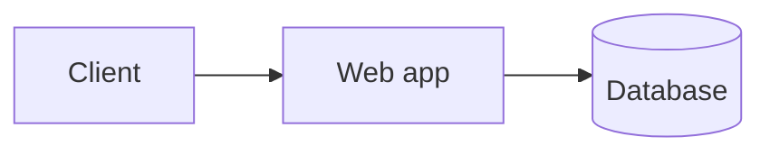

# Obsidian Flavored Markdown

Obsidian Flavored Markdown (OFM) is CommonMark + GitHub Flavored Markdown plus
Obsidian-specific syntax. Use this when creating or editing notes so they render
correctly in Obsidian. Adapted from kepano/obsidian-skills.

When operating on a live vault, pair this skill with `itkdev-obsidian-vault`
(which reads/writes vault files directly with the normal file tools).

## Properties (YAML frontmatter)

Start a note with a frontmatter block for metadata. It must be the first thing in
the file, fenced by `---`.

```markdown
---
title: Deployment notes
aliases: [deploy, release]
tags: [docker, infrastructure]
created: 2026-07-13
status: draft
---
```

- Reserved/known keys: `aliases` (list), `tags` (list), `cssclasses` (list).
- Custom keys are free-form: text, list, number, checkbox (`true`/`false`), or
  date/datetime (`YYYY-MM-DD`).
- Prefer lists in `[a, b]` flow style or `-` block style — both are valid YAML.

## Internal links (wikilinks)

Link between notes with `[[...]]`. Obsidian tracks renames automatically for
wikilinks, so **prefer wikilinks for anything inside the vault** and reserve
standard `[text](url)` Markdown links for external URLs.

```markdown
[[Note Name]]                     link by note name (extension omitted)
[[Note Name|Display Text]]        custom display text
[[Note Name#Heading]]             link to a heading within a note
[[Note Name#^block-id]]           link to a specific block
[[#Heading]]                      link to a heading in the current note
[[#^block-id]]                    link to a block in the current note
[[Diagram.canvas]]                link to a canvas — extension REQUIRED
[[Diagram.canvas|Display Text]]   canvas link with custom display text
```

> A bare `[[Name]]` **always** resolves to `Name.md`, never to `Name.canvas`. To
> link a canvas you MUST include the `.canvas` extension (e.g.
> `[[Architecture.canvas]]`), otherwise clicking the link creates a new empty
> `.md` stub. Same applies to linking any non-`.md` file.

Block IDs are defined by appending `^block-id` at the end of a paragraph or block:

```markdown
This is an important paragraph I want to reference. ^key-decision
```

## Embeds

Prefix a wikilink with `!` to embed the target inline.

```markdown
![[Note Name]]                    embed an entire note
![[Note Name#Heading]]            embed one section
![[image.png]]                    embed an image
![[image.png|200]]                embed image at 200px width
![[image.png|200x100]]            width x height
![[document.pdf]]                 embed a PDF
![[document.pdf#page=3]]          embed a specific PDF page
```

## Callouts

Callouts are highlighted admonition boxes built on blockquote syntax:

```markdown
> [!note] Optional title
> Body text of the callout.

> [!warning]- Collapsed by default
> The `-` after the type collapses it; `+` starts it expanded.
```

Common types: `note`, `abstract`, `info`, `tip`/`hint`, `success`, `question`,
`warning`/`caution`, `failure`, `danger`/`error`, `bug`, `example`, `quote`.
Types are case-insensitive.

## Tags

```markdown
#docker  #infra/config  #status/in-progress
```

- Nest tags with `/` to build hierarchies.
- Tags may also be declared in the `tags:` frontmatter key (without the `#`).
- Tags must not be purely numeric and may contain letters, digits, `_`, `-`, `/`.

## Comments

`%%` hides content from reading view and rendered output:

```markdown
%% This is a hidden inline comment %%

%%
Multi-line hidden block.
%%
```

## Math (LaTeX)

```markdown
Inline: $e^{i\pi} + 1 = 0$

Block:
$$
\int_0^\infty e^{-x}\,dx = 1
$$
```

## Diagrams (Mermaid)

Use a fenced code block with the `mermaid` language:

````markdown

````

You can reference notes inside Mermaid nodes with the class `internal-link`.

## Footnotes

```markdown
Here is a claim.[^1]

[^1]: The supporting detail.

Inline footnote: ^[This renders as a footnote too.]
```

## Task lists

```markdown
- [ ] Todo item
- [x] Done item
```

## Authoring checklist

- Frontmatter (if any) is the first block, valid YAML, fenced by `---`.
- Vault-internal references use `[[wikilinks]]`, not Markdown links.
- Embeds use `![[...]]`.
- Callout type is on the first line as `> [!type]`.
- Headings use ATX `#` style; leave a blank line around block elements.
